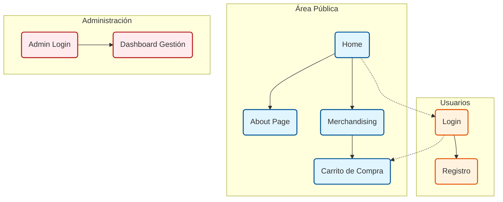

# ENTREGA FASE 1 - Diseño Conceptual y Visual

## 1. Título del proyecto

**Gienco Web - Plataforma Oficial de la Banda**

## 2. Resumen funcional de la aplicación

La aplicación es el sitio web oficial de la banda de rock "Gienco". Funciona como una plataforma centralizada donde los seguidores pueden conectar con el universo de la banda.

**Perfil de usuario:**
*   **Fans/Usuarios**: Pueden escuchar música, conocer la historia de la banda, ver y comprar productos de merchandising (camisetas, discos, etc.) y registrarse para tener un perfil propio.
*   **Administradores**: Tienen acceso a un área restringida para gestionar los pedidos realizados en la tienda.

**Tipología:**
Se trata de una **Aplicación Web (SPA - Single Page Application)** responsiva, accesible desde ordenadores de escritorio, tablets y dispositivos móviles. Gracias a la tecnología SPA, la navegación es fluida y permite funcionalidades como un reproductor de música continuo que no se detiene al cambiar de página.

## 3. Funcionalidades de la aplicación

A continuación se detallan las funciones principales desde el punto de vista del usuario:

*   **Navegación y Exploración**:
    *   Menú de navegación intuitivo para moverse entre "Home", "About", "Merchandising" y otras secciones.
    *   Reproductor de audio persistente en la parte inferior que permite escuchar música ininterrumpidamente mientra se navega.

*   **Tienda y Merchandising**:
    *   Visualización de un catálogo de productos con imágenes y precios.
    *   Gestión de un carrito de compra (añadir productos, ver resumen, modificar cantidades).
    *   Procesamiento de pedidos (checkout).

*   **Gestión de Usuarios (Fans)**:
    *   Registro de nuevos usuarios (Sign Up).
    *   Inicio de sesión (Login) para acceder a funcionalidades personalizadas o finalizar compras.

*   **Área de Administración**:
    *   Login específico para administradores.
    *   Panel de control para visualizar y gestionar los pedidos recibidos.

*   **Información**:
    *   Página "About" con la biografía e información de la banda.

## 4. Diseño de la interfaz: bocetos o mockups

A continuación se presentan los espacios para los mockups conceptuales de las pantallas principales.

### Pantalla Principal (Home)
Esta es la página de aterrizaje, con una imagen impactante de la banda, acceso directo a las últimas noticias o lanzamientos, y el menú de navegación principal visible.
 
 
 
(Insertar Mockup Home aquí)
 
 
 

### Página de Productos (Merchandising)
Muestra una rejilla con los productos disponibles. Cada tarjeta de producto incluye la foto, el nombre, el precio y un botón para añadir al carrito.
 
 
 
(Insertar Mockup Productos aquí)
 
 
 

### Carrito de Compra (Cart)
Listado de los artículos seleccionados por el usuario, con el subtotal y la opción de proceder al pago.
 
 
 
(Insertar Mockup Carrito aquí)
 
 
 

### Login / Registro
Formulario sencillo y limpio para la entrada de usuarios o la creación de nuevas cuentas.
 
 
 
(Insertar Mockup Login aquí)
 
 
 

### Panel de Administración (Dashboard)
Tabla o listado visible solo para administradores donde se muestran los pedidos recientes con su estado.
 
 
 
(Insertar Mockup Admin aquí)
 
 
 

## 5. Diagrama de navegación o flujo de la aplicación

El siguiente diagrama muestra cómo se conectan las diferentes pantallas de la aplicación.

## 6. Tecnologías previstas

Para el desarrollo de este proyecto se utilizarán las siguientes herramientas y tecnologías profesionales:

*   **Lenguaje de Programación**: JavaScript (ES6+).
*   **Framework Frontend**: **Vue.js 3** (con Composition API) para la creación de la interfaz de usuario reactiva y SPA.
*   **Gestión de Estado**: **Pinia** (para gestionar el carrito y la sesión de usuario).
*   **Estilos**: **Tailwind CSS** (para un diseño rápido, moderno y responsivo).
*   **Infraestructura (Backend Serverless)**:
    *   **AWS Cognito**: Para la gestión de usuarios y seguridad.
    *   **AWS Lambda & API Gateway**: Para la lógica de negocio (pedidos).
    *   **AWS DynamoDB**: Base de datos NoSQL para almacenar la información.
*   **Entorno de Desarrollo (IDE)**: Visual Studio Code.
*   **Control de Versiones y Despliegue**: Git y GitHub Actions (CI/CD automatizado).
