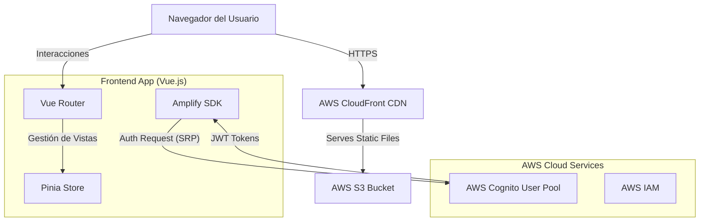

# 🎸 Gienco Web
Una aplicación web oficial para la banda Gienco construida con Vue 3, Vite y servicios serverless de AWS.

## Autores
*   **Itai Picornell Cortés**

## Descripción General
Este proyecto es una aplicación web SPA (Single Page Application) moderna que sirve como plataforma oficial para la banda de rock Gienco. Demuestra la integración de un frontend reactivo de alto rendimiento con servicios en la nube de AWS para la gestión segura de identidad. La aplicación cuenta con un reproductor de audio personalizado, tienda de merchandising con gestión de estado global y un panel de administración protegido.

## Características
*   **Autenticación Administrativa Completa**: Gestión segura de acceso al panel de administración mediante AWS Cognito.
*   **Reproductor de Audio SPA**: Reproducción continua de música sin cortes durante la navegación gracias a la arquitectura Single Page Application.
*   **Tienda de Merchandising**: Carrito de compras persistente con gestión de estado compleja (Pinia).
*   **Arquitectura Serverless**: Frontend desacoplado que escala automáticamente sin gestión de servidores.

## Stack Tecnológico

### Frontend
*   **Framework**: Vue 3 (Composition API & Script Setup)
*   **Herramienta de Build**: Vite (Builds optimizados y HMR instantáneo)
*   **Enrutamiento**: Vue Router 4
*   **Gestión de Estado**: Pinia (Store modular para Auth y Carrito)
*   **Estilos**: Tailwind CSS 3
*   **Autenticación**: AWS Amplify Auth SDK (integración con Cognito)

### Backend & Cloud (AWS)
*   **Gestión de Identidad**: AWS Cognito User Pools (Región `eu-south-2`)
*   **Seguridad**: IAM (Identity and Access Management) para roles y políticas
*   **Despliegue**: Preparado para AWS S3 + CloudFront

## Arquitectura



## ☁️ Decisiones de Arquitectura Cloud
### ¿Por qué AWS Cognito?
Para la gestión de identidades en el panel de administración, hemos optado por AWS Cognito frente a soluciones tradicionales de base de datos SQL/NoSQL por las siguientes razones críticas:

1.  **Seguridad Gestionada**: AWS se encarga de la seguridad de las contraseñas, encriptación en reposo y tránsito, y protección contra ataques comunes (fuerza bruta, etc). No almacenamos credenciales en nuestra base de datos, reduciendo drásticamente la superficie de ataque.
2.  **Protocolo SRP (Secure Remote Password)**: La autenticación se realiza mediante SRP, lo que significa que la contraseña nunca viaja por la red, ni siquiera encriptada. Es un estándar de seguridad superior al envío de hashes.
3.  **Tokens JWT Estándar**: Cognito devuelve tokens JWT (Access, ID, Refresh) estándar de la industria, lo que facilita la integración futura con otras APIs o servicios (como API Gateway) sin reescribir la lógica de autorización.
4.  **Escalabilidad sin Mantenimiento**: Al ser un servicio serverless y gestionado, no requiere mantenimiento de servidores de autenticación y escala desde 1 a millones de usuarios automáticamente.

## Estructura del Proyecto

```
Gienco_Web/
├── src/
│   ├── assets/              # Recursos estáticos (imágenes, fuentes)
│   ├── components/          # Componentes Vue reutilizables (Navbar, Footer, Player)
│   ├── router/              # Configuración de rutas (Vue Router)
│   ├── stores/              # Stores de Pinia (auth.js, cart.js)
│   ├── views/               # Vistas principales (Home, Products, AdminLogin)
│   ├── App.vue              # Componente raíz
│   └── main.js              # Punto de entrada (Configuración Amplify y Vue)
├── public/                  # Archivos públicos estáticos
├── index.html               # Punto de entrada HTML
├── package.json             # Dependencias del proyecto
├── vite.config.js           # Configuración de Vite
└── README.md                # Documentación
```

## Configuración para Desarrollo Local

### 1. Clonar el repositorio
```bash
git clone <url-del-repositorio>
cd Gienco_Web
```

### 2. Instalar dependencias
```bash
npm install
```

### 3. Ejecutar servidor de desarrollo
```bash
npm run dev
```
La aplicación estará disponible en `http://localhost:5173/`

### 4. Build de Producción
Para generar los archivos optimizados para despliegue:
```bash
npm run build
```
Los archivos se generarán en la carpeta `dist/`.

## Endpoints y Servicios Externos

### AWS Cognito (Auth)
*   **Región**: `eu-south-2` (España)
*   **Configuración**: Las credenciales (User Pool ID, Client ID) se deben configurar en un archivo `.env` localmente.
*   **Flujo**: Autenticación directa mediante Amplify SDK (sin redirecciones externas visibles para mantener la experiencia de usuario).

### Configuración de Variables de Entorno (.env)
Crea un archivo `.env` en la raíz del proyecto con el siguiente contenido:
```env
VITE_USER_POOL_ID=tu_user_pool_id
VITE_USER_POOL_CLIENT_ID=tu_client_id
```

