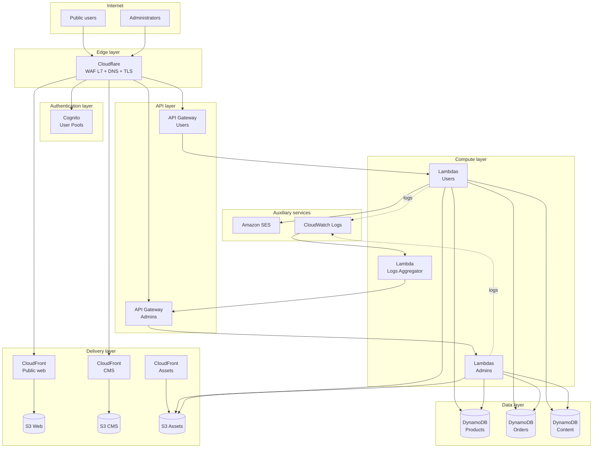

# GIENCO — Official Band Platform

> Serverless Single Page Application (SPA) built on AWS, designed as a modern cloud architecture with least-privilege principles, defense in depth and centralized observability.

[](https://vuejs.org/)
[](https://aws.amazon.com/)
[](https://www.cloudflare.com/)
[](https://vitejs.dev/)
[](https://tailwindcss.com/)
[](https://pinia.vuejs.org/)

---

## Table of Contents

- [Overview](#overview)
- [Architecture](#architecture)
  - [Bird's-eye view](#birds-eye-view)
  - [Presentation layer](#presentation-layer)
  - [Content delivery layer](#content-delivery-layer)
  - [API layer](#api-layer)
  - [Serverless compute layer](#serverless-compute-layer)
  - [Data layer](#data-layer)
  - [Authentication layer](#authentication-layer)
  - [Observability layer](#observability-layer)
  - [Admin CMS](#admin-cms)
- [Security](#security)
- [CI/CD](#cicd)
- [Tech Stack](#tech-stack)
- [Project Structure](#project-structure)
- [Access](#access)

---

## Overview

**GIENCO** is the official platform of the band: a public website with a merchandising catalog, band information, live events, Spotify integration and a full ordering process. Behind the public website there is a custom CMS (hosted in a private repository) that allows people without technical knowledge to manage all the visual content, products and orders in real time.

The platform is designed as a **100% serverless architecture on AWS**, with no servers to maintain, automatic scaling and component-level isolation. Every decision — from the choice of services to the API segregation — is made with architecture, security and maintainability in mind.

### Key features

- Reactive SPA built on Vue 3 + Composition API
- Serverless architecture with automatic scaling
- Two segregated APIs: one public for users and one exclusive to the CMS
- Federated authentication with AWS Cognito and role segregation
- Custom CMS for managing visuals, products and orders
- Centralized real-time log panel
- Multi-layer protection: AWS Shield (L3/L4) + Cloudflare WAF (L7)
- Automated continuous deployment with GitHub Actions

---

## Architecture

### Bird's-eye view

The platform follows an *event-driven* serverless architecture organized in independent layers. Each layer has a clear responsibility and communicates with the others through well-defined interfaces (HTTPS, REST API, AWS SDK). This separation makes it possible to scale, secure and observe every component in isolation.


```mermaid
graph TB
    subgraph "Internet"
        U[Public users]
        A[Administrators]
    end

    subgraph "Edge layer"
        CF[Cloudflare<br/>WAF L7 + DNS + TLS]
    end

    subgraph "Delivery layer"
        CFRONT_WEB[CloudFront<br/>Public web]
        CFRONT_ADMIN[CloudFront<br/>CMS]
        CFRONT_ASSETS[CloudFront<br/>Assets]
        S3_WEB[(S3 Web)]
        S3_ADMIN[(S3 CMS)]
        S3_ASSETS[(S3 Assets)]
    end

    subgraph "Authentication layer"
        COG[Cognito<br/>User Pools]
    end

    subgraph "API layer"
        API_USERS[API Gateway<br/>Users]
        API_ADMIN[API Gateway<br/>Admins]
    end

    subgraph "Compute layer"
        L_USERS[Lambdas<br/>Users]
        L_ADMIN[Lambdas<br/>Admins]
        L_LOGS[Lambda<br/>Logs Aggregator]
    end

    subgraph "Data layer"
        D_PROD[(DynamoDB<br/>Products)]
        D_ORD[(DynamoDB<br/>Orders)]
        D_CONT[(DynamoDB<br/>Content)]
    end

    subgraph "Auxiliary services"
        SES[Amazon SES]
        CW[CloudWatch Logs]
    end

    U --> CF
    A --> CF
    CF --> CFRONT_WEB
    CF --> CFRONT_ADMIN
    CFRONT_WEB --> S3_WEB
    CFRONT_ADMIN --> S3_ADMIN
    CFRONT_ASSETS --> S3_ASSETS

    CF --> COG
    CF --> API_USERS
    CF --> API_ADMIN

    API_USERS --> L_USERS
    API_ADMIN --> L_ADMIN

    L_USERS --> D_PROD
    L_USERS --> D_CONT
    L_USERS --> D_ORD
    L_USERS --> SES
    L_USERS --> S3_ASSETS

    L_ADMIN --> D_PROD
    L_ADMIN --> D_CONT
    L_ADMIN --> D_ORD
    L_ADMIN --> S3_ASSETS

    L_USERS -.logs.-> CW
    L_ADMIN -.logs.-> CW
    CW --> L_LOGS
    L_LOGS --> API_ADMIN
```

---

### Presentation layer

The presentation layer is a **Vue 3 SPA** compiled as a static bundle. Choosing an SPA gives a smooth user experience, with no full page reloads between views, and it fully decouples the frontend from the backend.

- **Vue 3 with Composition API**: logic is reused through composables (`composables/`) instead of mixins, which improves state traceability and typing.
- **Vue Router** with *navigation guards* to protect private routes (authenticated cart, profile, checkout).
- **Pinia** as the central state store: session, cart, global notifications.
- **Tailwind CSS** as a *utility-first* design system, with consistent tokens and a *mobile-first* approach.
- **Vite** as the bundler: build optimized with *tree-shaking*, route-based *code-splitting* and minification through Terser (removing `console` and `debugger` statements in production).

The build output is static: HTML, CSS, JS and images. Zero application server.

---

### Content delivery layer

Static content is distributed through **Amazon CloudFront**, the AWS global CDN:

- Caching at *edge locations* for minimal latency from anywhere in the world.
- TLS termination managed with **AWS Certificate Manager (ACM)**, enforcing HTTPS end to end.
- Private origin in an **Amazon S3** bucket with no direct public access: the bucket is only reachable through CloudFront via *Origin Access*, which prevents direct URL access to the bucket.
- Independent distributions for the public website, the CMS and the assets, allowing different caching policies and security headers per distribution.

**Cloudflare** sits in front of CloudFront as an additional edge layer, handling DNS, TLS and WAF rules at layer 7.

---

### API layer

There are **two segregated API Gateways**, each one with its own domain, authorizers and set of routes:

| API | Audience | Typical methods | Authentication |
|-----|----------|------------------|----------------|
| **Users API** | Public traffic | `GET` for products, content, assets and `POST` for orders | Mixed (public + protected routes) |
| **Admins API** | Internal CMS | Full CRUD over products, content, orders, logs | Cognito with admin group |

This segregation is a **deliberate architectural decision**: separating the public plane from the administrative plane reduces the attack surface on the CMS side, allows different *throttling*, CORS and WAF policies, and makes sure that a failure in one API does not affect the other.

Each API Gateway applies:

- **Schema validation** on incoming requests (rejection at the edge before invoking Lambda).
- **Strictly scoped CORS** limited to legitimate origins.
- **Cognito authorizers** on protected routes, which validate the JWT signature and *claims* before delegating to the business logic.
- **Throttling** and quotas configured to mitigate abuse and uncontrolled spikes.

---

### Serverless compute layer

All business logic runs on **AWS Lambda**. Functions are grouped by functional domain (products, orders, content, assets, logs) and, within each domain, separated by audience (public user vs. administrator).

Principles applied:

- **One function, one responsibility**: every Lambda does one specific thing, which makes testing and permissions easier.
- **Least privilege**: every Lambda assumes an IAM role with access only to the resources it really needs (one specific table, one specific S3 prefix, one specific action).
- **Stateless**: no function depends on in-memory state between invocations. State lives in DynamoDB and S3.
- **Cold start mitigation**: lightweight packages, modern runtime and limited dependencies.

Representative functions (without exposing internal names):

- Read operations on the catalog, content and assets for the public website.
- Order processing with persistence in DynamoDB and email notification through **Amazon SES**.
- CMS operations on products, content and orders.
- **Logs aggregator**: a dedicated Lambda queries CloudWatch, normalizes and classifies the entries from every function, and exposes an endpoint so the CMS log panel can consume them in real time.

---

### Data layer

Persistence is split between two services:

- **Amazon DynamoDB** for structured data:
  - `Products` — merchandising catalog.
  - `Orders` — orders placed by fans.
  - `Content` — editable blocks of the website (texts, sections, homepage configuration, etc.).

  DynamoDB was chosen for its serverless model, automatic scaling and consistent latency under variable load.

- **Amazon S3** for binary objects (product images, band photos, multimedia resources). The assets bucket is only exposed through CloudFront, never directly.

---

### Authentication layer

**Amazon Cognito** manages user identity through User Pools, with **separate groups** for standard users and administrators. The flow follows the standard OAuth2 / OpenID Connect pattern:

1. The user signs up or logs in through the Amplify SDK integrated in the frontend.
2. Cognito returns a pair of cryptographically signed tokens (ID Token + Access Token).
3. The frontend attaches the token to every request sent to API Gateway.
4. The Cognito authorizer in API Gateway validates the signature, the expiration and the *claims* of the token before invoking the corresponding Lambda.
5. The Lambda makes fine-grained authorization decisions (for example, "only the owner can see their order") using the *claims* from the token.

Access to the CMS is restricted to the `admin` group in Cognito. A standard user, even with a valid token, cannot invoke the administrative routes: the rejection happens at the edge, before reaching the business logic.

---

### Observability layer

Every Lambda function emits logs to **Amazon CloudWatch Logs**. To make these logs useful and consumable from the CMS, a **custom aggregator** has been implemented:

- A dedicated Lambda (*Logs Aggregator*) queries the *log groups* of every function.
- It classifies the entries by level (`INFO`, `WARN`, `ERROR`) and by source function.
- It exposes the normalized data through the administrative API.
- The CMS displays it on a **real-time log panel**, which allows detecting and diagnosing incidents without having to open the AWS console.

This turns CloudWatch into the source of truth and the CMS into a single point of operation, keeping the "single pane of glass" principle for the non-technical team that manages the website.

---

### Admin CMS

The CMS is a **separate SPA hosted on its own CloudFront distribution**, on a domain different from the public website, and with its own S3 origin bucket. Its source code lives in a **private repository** for security reasons.

From the CMS, the following can be managed:

- Catalog products (creation, edition, removal).
- Orders (consultation, status changes, management).
- Visual content of the public website (editable blocks, images, configuration).
- Operational logs in real time.

The CMS is only accessible to users authenticated in Cognito and belonging to the administrators group. Any request to the administrative API that does not carry a token with the correct group membership is rejected at the edge by API Gateway.

---

## Security

The platform applies **defense in depth**: security is not a single layer, but a property present at every level.

### Edge protection

- **Cloudflare** in front of CloudFront acts as a WAF at layer 7 (HTTP/HTTPS), filtering malicious traffic, known bots and attack patterns before they ever reach the AWS infrastructure.
- **AWS Shield Standard** mitigates volumetric attacks at layers 3 and 4 (network and transport) automatically and transparently.

### Transport

- **HTTPS enforced** on every domain through ACM-managed certificates with automatic renewal.
- Modern TLS policies (legacy versions disabled).

### Identity and access

- **Amazon Cognito** as the single identity provider.
- **Signed, short-lived JWT tokens**.
- **Group-based segregation** to differentiate public users from administrators.
- **IAM least privilege**: one role per Lambda, each role limited strictly to the resources it really needs.

### Data access

- **Private S3 buckets**: access is only possible through CloudFront via *Origin Access*.
- DynamoDB tables only accessed from Lambdas with explicit permissions.
- Input validation in every function to prevent injections and abuse.

### Audit

- Every Lambda invocation is recorded in CloudWatch Logs.
- The aggregator centralizes these events, which makes tracing easier in case of an incident.

---

## CI/CD

Deployment is fully automated through **GitHub Actions**:

1. A *push* to the production branch triggers the workflow.
2. Dependencies are installed and the bundle is built with Vite.
3. The artifacts are uploaded to the origin S3 bucket.
4. The CloudFront cache is invalidated so changes propagate immediately.

Authentication between GitHub Actions and AWS is handled through **OpenID Connect (OIDC)**: the workflow directly assumes a dedicated IAM role for deployment, with no need to store long-lived *access keys* as GitHub secrets. This removes the risk associated with long-lived credentials and allows every deployment to use temporary credentials signed by AWS STS. The assumed role has permissions strictly limited to deployment operations (uploading to S3 and invalidating CloudFront), never general administrative permissions.

---

## Tech Stack

### Frontend

- **Vue.js 3** — Progressive framework with Composition API
- **Vue Router 4** — SPA routing with navigation guards
- **Pinia 2** — Reactive and modular state management
- **Tailwind CSS 4** — Utility-first design system
- **Vite 6** — Next-generation bundler
- **Terser** — Minification and log stripping in production

### Cloud Integration

- **AWS Amplify** — Client SDK for Cognito and API Gateway

### AWS Infrastructure

- **CloudFront** — CDN and secure content delivery
- **S3** — Storage for static bundle and assets
- **API Gateway** — REST API management
- **Lambda** — Serverless compute
- **DynamoDB** — Serverless NoSQL database
- **Cognito** — Identity and access control
- **SES** — Transactional email delivery
- **CloudWatch** — Logs and observability
- **ACM** — TLS certificates
- **IAM** — Roles and least-privilege policies
- **Route 53** — DNS resolution
- **AWS Shield Standard** — DDoS mitigation at L3/L4

### Edge Layer

- **Cloudflare** — DNS, TLS and WAF at layer 7

### CI/CD

- **GitHub Actions** — Automated build and deployment pipeline

---

## Project Structure

```
Gienco_Web/
│
├── .github/workflows/      GitHub Actions pipelines
├── public/                 Static assets served as-is
│   ├── audio/              Audio (intro, effects)
│   ├── images/             Fallback images and favicon
│   └── robots.txt
│
├── src/
│   ├── components/         Reusable Vue components
│   │   ├── Navbar.vue
│   │   ├── Footer.vue
│   │   ├── BandCarousel.vue
│   │   ├── EventsCalendar.vue
│   │   ├── SpotifyPlayer.vue
│   │   └── NotificationModal.vue
│   │
│   ├── views/              Views (pages) bound to routes
│   │   ├── Home.vue
│   │   ├── About.vue
│   │   ├── Products.vue
│   │   ├── Cart.vue
│   │   ├── Checkout.vue
│   │   ├── Login.vue
│   │   ├── SignUp.vue
│   │   ├── ResetPassword.vue
│   │   ├── OrderSuccess.vue
│   │   ├── PrivacyPolicy.vue
│   │   ├── TermsOfService.vue
│   │   └── NotFound.vue
│   │
│   ├── composables/        Reusable composition functions
│   │   ├── useContent.js   Hydration of dynamic content from API
│   │   └── useGallery.js   Image gallery loading
│   │
│   ├── services/           Service clients and abstractions
│   │   └── api.js          HTTP client for the public API
│   │
│   ├── stores/             Pinia stores
│   │   ├── auth.js         Session state (Cognito)
│   │   ├── cart.js         Cart state
│   │   └── notification.js Global notifications
│   │
│   ├── router/             Routing config and guards
│   ├── utils/              Helpers
│   ├── App.vue             Root component
│   ├── main.js             App bootstrap
│   └── index.css           Global styles and Tailwind
│
├── index.html              Entry HTML with SEO and meta tags
├── vite.config.js          Vite configuration
├── package.json
└── README.md
```

---

## Access

**Public website:** [https://giencoband.com](https://giencoband.com)

---

**Built with dedication for GIENCO**
