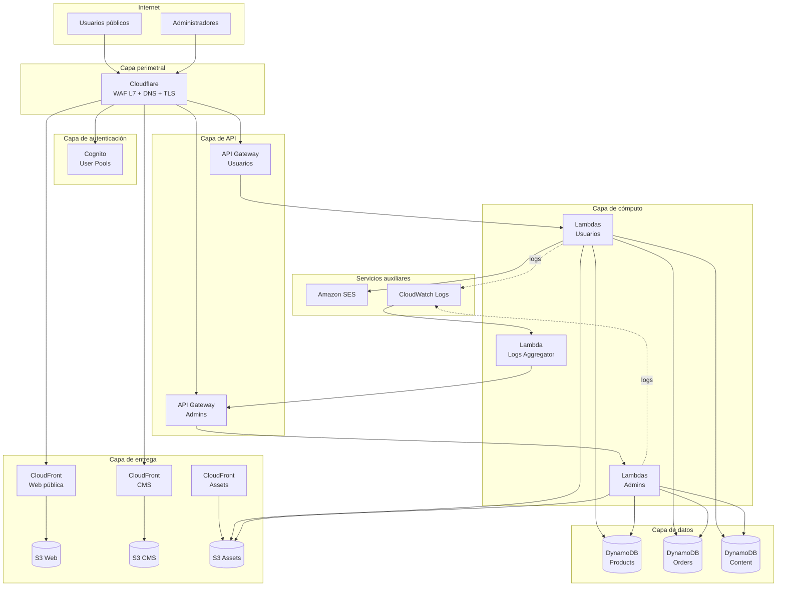

# GIENCO — Plataforma Oficial de la Banda

> Single Page Application (SPA) serverless construida sobre AWS, diseñada como una arquitectura cloud moderna con principio de mínimo privilegio, defensa en profundidad y observabilidad centralizada.

[](https://vuejs.org/)
[](https://aws.amazon.com/)
[](https://www.cloudflare.com/)
[](https://vitejs.dev/)
[](https://tailwindcss.com/)
[](https://pinia.vuejs.org/)

---

## Tabla de Contenidos

- [Visión General](#visión-general)
- [Arquitectura](#arquitectura)
  - [Vista de pájaro](#vista-de-pájaro)
  - [Capa de presentación](#capa-de-presentación)
  - [Capa de entrega de contenido](#capa-de-entrega-de-contenido)
  - [Capa de API](#capa-de-api)
  - [Capa de cómputo serverless](#capa-de-cómputo-serverless)
  - [Capa de datos](#capa-de-datos)
  - [Capa de autenticación](#capa-de-autenticación)
  - [Capa de observabilidad](#capa-de-observabilidad)
  - [CMS administrativo](#cms-administrativo)
- [Seguridad](#seguridad)
- [CI/CD](#cicd)
- [Stack Tecnológico](#stack-tecnológico)
- [Estructura del Proyecto](#estructura-del-proyecto)
- [Acceso](#acceso)

---

## Visión General

**GIENCO** es la plataforma oficial de la banda musical: web pública con catálogo de merchandising, información del grupo, eventos en directo, integración con Spotify y proceso completo de pedido. Detrás de la web pública existe un CMS propio (alojado en un repositorio privado) que permite a personas sin conocimientos técnicos gestionar todo el contenido visual, los productos y los pedidos en tiempo real.

La plataforma se ha diseñado como una **arquitectura 100% serverless en AWS**, sin servidores que mantener, con escalado automático y aislamiento por componente. Cada decisión —desde la elección de servicios hasta la separación de APIs— está pensada en clave de arquitectura, seguridad y mantenibilidad.

### Características principales

- SPA reactiva basada en Vue 3 + Composition API
- Arquitectura serverless con escalado automático
- Doble API segregada: una pública para usuarios y otra exclusiva del CMS
- Autenticación federada mediante AWS Cognito con segregación de roles
- CMS propio para gestión visual, de productos y de pedidos
- Panel de logs centralizado en tiempo real
- Protección multicapa: AWS Shield (L3/L4) + Cloudflare WAF (L7)
- Despliegue continuo automatizado mediante GitHub Actions

---

## Arquitectura

### Vista de pájaro

La plataforma sigue una arquitectura serverless de tipo *event-driven* organizada en capas independientes. Cada capa tiene una responsabilidad acotada y se comunica con el resto a través de interfaces bien definidas (HTTPS, API REST, SDK de AWS). Esta separación permite escalar, securizar y observar cada componente de forma aislada.


```mermaid
graph TB
    subgraph "Internet"
        U[Usuarios públicos]
        A[Administradores]
    end

    subgraph "Capa perimetral"
        CF[Cloudflare<br/>WAF L7 + DNS + TLS]
    end

    subgraph "Capa de entrega"
        CFRONT_WEB[CloudFront<br/>Web pública]
        CFRONT_ADMIN[CloudFront<br/>CMS]
        CFRONT_ASSETS[CloudFront<br/>Assets]
        S3_WEB[(S3 Web)]
        S3_ADMIN[(S3 CMS)]
        S3_ASSETS[(S3 Assets)]
    end

    subgraph "Capa de autenticación"
        COG[Cognito<br/>User Pools]
    end

    subgraph "Capa de API"
        API_USERS[API Gateway<br/>Usuarios]
        API_ADMIN[API Gateway<br/>Admins]
    end

    subgraph "Capa de cómputo"
        L_USERS[Lambdas<br/>Usuarios]
        L_ADMIN[Lambdas<br/>Admins]
        L_LOGS[Lambda<br/>Logs Aggregator]
    end

    subgraph "Capa de datos"
        D_PROD[(DynamoDB<br/>Products)]
        D_ORD[(DynamoDB<br/>Orders)]
        D_CONT[(DynamoDB<br/>Content)]
    end

    subgraph "Servicios auxiliares"
        SES[Amazon SES]
        CW[CloudWatch Logs]
    end

    U --> CF
    A --> CF
    CF --> CFRONT_WEB
    CF --> CFRONT_ADMIN
    CFRONT_WEB --> S3_WEB
    CFRONT_ADMIN --> S3_ADMIN
    CFRONT_ASSETS --> S3_ASSETS

    CF --> COG
    CF --> API_USERS
    CF --> API_ADMIN

    API_USERS --> L_USERS
    API_ADMIN --> L_ADMIN

    L_USERS --> D_PROD
    L_USERS --> D_CONT
    L_USERS --> D_ORD
    L_USERS --> SES
    L_USERS --> S3_ASSETS

    L_ADMIN --> D_PROD
    L_ADMIN --> D_CONT
    L_ADMIN --> D_ORD
    L_ADMIN --> S3_ASSETS

    L_USERS -.logs.-> CW
    L_ADMIN -.logs.-> CW
    CW --> L_LOGS
    L_LOGS --> API_ADMIN
```

---

### Capa de presentación

La capa de presentación es una **SPA en Vue 3** compilada como un bundle estático. La elección de SPA permite una experiencia de usuario fluida, sin recargas completas entre páginas, y desacopla por completo el frontend del backend.

- **Vue 3 con Composition API**: composición por funciones reutilizables (`composables/`) en lugar de mixins, lo que mejora la trazabilidad del estado y el tipado.
- **Vue Router** con *navigation guards* para proteger rutas privadas (carrito autenticado, perfil, checkout).
- **Pinia** como store centralizado de estado: sesión, carrito, notificaciones globales.
- **Tailwind CSS** como sistema de diseño *utility-first*, con tokens consistentes y diseño *mobile-first*.
- **Vite** como bundler: build optimizado con *tree-shaking*, *code-splitting* por ruta y minificación con Terser (incluyendo eliminación de `console` y `debugger` en producción).

El resultado del build es estático: HTML, CSS, JS e imágenes. Cero servidor de aplicación.

---

### Capa de entrega de contenido

La distribución del contenido estático se hace a través de **Amazon CloudFront**, la CDN global de AWS:

- Cacheo en *edge locations* para latencia mínima desde cualquier parte del mundo.
- Terminación TLS gestionada con **AWS Certificate Manager (ACM)**, forzando HTTPS de extremo a extremo.
- Origen privado en un bucket de **Amazon S3** sin acceso público directo: el bucket solo es alcanzable a través de CloudFront mediante *Origin Access*, lo que evita el acceso directo por URL al bucket.
- Distribuciones independientes para la web pública, el CMS y los assets, lo que permite políticas de caché y cabeceras de seguridad diferenciadas.

**Cloudflare** actúa como capa adicional delante de CloudFront, gestionando DNS, TLS y reglas WAF en capa 7.

---

### Capa de API

Existen **dos API Gateways segregadas**, cada una con su propio dominio, autorizadores y conjunto de rutas:

| API | Audiencia | Métodos típicos | Autenticación |
|-----|-----------|------------------|----------------|
| **API Usuarios** | Tráfico público | `GET` de productos, contenido, assets y `POST` de pedidos | Mixta (rutas públicas + protegidas) |
| **API Admins** | CMS interno | CRUD completo sobre productos, contenido, pedidos, logs | Cognito con grupo de admin |

Esta segregación es una **decisión arquitectónica deliberada**: separar el plano público del plano administrativo reduce la superficie de ataque del lado del CMS, permite políticas distintas de *throttling*, CORS y WAF, y evita que un fallo en una API afecte a la otra.

Cada API Gateway aplica:

- **Validación de esquema** en las peticiones entrantes (rechazo en el borde antes de invocar Lambda).
- **CORS estrictamente acotado** a los orígenes legítimos.
- **Autorizadores Cognito** para las rutas protegidas, que validan el JWT y los *claims* antes de delegar en la lógica de negocio.
- **Throttling** y cuotas configurados para mitigar abuso y picos descontrolados.

---

### Capa de cómputo serverless

Toda la lógica de negocio se ejecuta en **AWS Lambda**. Las funciones están agrupadas por dominio funcional (productos, pedidos, contenido, assets, logs) y, dentro de cada dominio, separadas por audiencia (usuario público vs. administrador).

Principios aplicados:

- **Una función, una responsabilidad**: cada Lambda hace una cosa concreta, lo que facilita su testeo y su política de permisos.
- **Mínimo privilegio**: cada Lambda asume un rol IAM con acceso únicamente a los recursos que necesita (una tabla concreta, un prefijo de S3 concreto, una acción concreta).
- **Stateless**: ninguna función depende de estado en memoria entre invocaciones. El estado vive en DynamoDB y S3.
- **Cold start mitigation**: paquetes ligeros, runtime moderno y dependencias acotadas.

Funciones representativas (sin desvelar nombres internos):

- Lectura de catálogo, contenido y assets para la web pública.
- Procesamiento de pedidos con persistencia en DynamoDB y notificación por email vía **Amazon SES**.
- Operaciones del CMS sobre productos, contenido y pedidos.
- **Agregador de logs**: una Lambda dedicada consulta CloudWatch, normaliza y clasifica las entradas de todas las funciones, y expone un endpoint para que el panel de logs del CMS las consuma en tiempo real.

---

### Capa de datos

La persistencia se reparte entre dos servicios:

- **Amazon DynamoDB** para datos estructurados:
  - `Products` — catálogo de merchandising.
  - `Orders` — pedidos realizados por los fans.
  - `Content` — bloques editables de la web (textos, secciones, configuración de portada, etc.).

  Se eligió DynamoDB por su modelo serverless, su escalado automático y su latencia consistente bajo carga variable.

- **Amazon S3** para objetos binarios (imágenes de productos, fotos de banda, recursos multimedia). El bucket de assets está expuesto exclusivamente vía CloudFront, nunca de forma directa.

---

### Capa de autenticación

**Amazon Cognito** gestiona la identidad de los usuarios mediante User Pools, con **grupos diferenciados** para usuario estándar y administrador. El flujo es estándar OAuth2 / OpenID Connect:

1. El usuario se registra o inicia sesión a través del SDK de Amplify integrado en el frontend.
2. Cognito devuelve un par de tokens (ID Token + Access Token) firmados criptográficamente.
3. El frontend adjunta el token en las peticiones a API Gateway.
4. El autorizador Cognito de API Gateway valida la firma, la expiración y los *claims* del token antes de invocar la Lambda correspondiente.
5. La Lambda toma decisiones de autorización fina (por ejemplo, "solo el dueño puede ver su pedido") usando los *claims* del token.

El acceso al CMS está restringido al grupo `admin` de Cognito. Un usuario estándar, aunque obtenga un token válido, no puede invocar las rutas administrativas: el rechazo ocurre en el borde, antes incluso de tocar la lógica.

---

### Capa de observabilidad

Todas las funciones Lambda emiten logs a **Amazon CloudWatch Logs**. Para hacer estos logs útiles y consumibles desde el CMS se ha implementado un **agregador propio**:

- Una Lambda dedicada (*Logs Aggregator*) consulta los *log groups* de todas las funciones.
- Clasifica las entradas por nivel (`INFO`, `WARN`, `ERROR`) y por función origen.
- Expone los datos normalizados a través de la API administrativa.
- El CMS los muestra en un **panel de logs en tiempo real**, lo que permite detectar y diagnosticar incidencias sin tener que entrar a la consola de AWS.

Esto convierte a CloudWatch en la fuente de verdad y al CMS en un punto único de operación, manteniendo el principio de "una sola pantalla de cristal" para el equipo no técnico que gestiona la web.

---

### CMS administrativo

El CMS es una **SPA independiente alojada en una distribución de CloudFront propia**, en un dominio distinto al de la web pública, y con su propio bucket S3 de origen. Su código fuente está en un **repositorio privado** por motivos de seguridad.

Desde el CMS se gestiona:

- Productos del catálogo (creación, edición, retirada).
- Pedidos (consulta, cambio de estado, gestión).
- Contenido visual de la web pública (bloques editables, imágenes, configuración).
- Logs operativos en tiempo real.

El CMS solo es accesible para usuarios autenticados en Cognito y pertenecientes al grupo de administradores. Cualquier petición a la API administrativa que no porte un token con la pertenencia correcta es rechazada en el borde por API Gateway.

---

## Seguridad

La plataforma aplica **defensa en profundidad**: la seguridad no es una capa, sino una propiedad presente en todos los niveles.

### Protección perimetral

- **Cloudflare** delante de CloudFront actúa como WAF en capa 7 (HTTP/HTTPS), filtrando tráfico malicioso, bots conocidos y patrones de ataque antes de que toquen la infraestructura de AWS.
- **AWS Shield Standard** mitiga ataques volumétricos en capa 3 y 4 (red y transporte) de forma automática y transparente.

### Transporte

- **HTTPS forzado** en todos los dominios mediante certificados gestionados por ACM y renovación automática.
- Políticas TLS modernas (versiones obsoletas desactivadas).

### Identidad y acceso

- **Amazon Cognito** como proveedor único de identidad.
- **Tokens JWT** firmados y de corta duración.
- **Segregación por grupos** para diferenciar usuario público de administrador.
- **Mínimo privilegio en IAM**: cada Lambda con su rol, cada rol con permisos acotados a los recursos estrictamente necesarios.

### Acceso a datos

- Buckets S3 **sin acceso público**: el acceso solo es posible a través de CloudFront mediante *Origin Access*.
- Tablas DynamoDB accedidas únicamente desde las Lambdas con permisos explícitos.
- Validación de entrada en todas las funciones para prevenir inyecciones y abusos.

### Auditoría

- Toda invocación Lambda queda registrada en CloudWatch Logs.
- El agregador centraliza estos eventos, lo que facilita el rastreo en caso de incidencia.

---

## CI/CD

El despliegue está completamente automatizado mediante **GitHub Actions**:

1. *Push* a la rama de producción dispara el workflow.
2. Se instalan dependencias y se construye el bundle con Vite.
3. Los artefactos se suben al bucket S3 de origen.
4. Se invalida la caché de CloudFront para que los cambios se propaguen de inmediato.

Las credenciales para el despliegue se gestionan mediante **GitHub Secrets** y se asumen a través de un rol IAM con permisos estrictamente acotados a las operaciones de despliegue (no admin general).

---

## Stack Tecnológico

### Frontend

- **Vue.js 3** — Framework progresivo con Composition API
- **Vue Router 4** — Enrutamiento SPA con guards de navegación
- **Pinia 2** — Gestión de estado reactiva y modular
- **Tailwind CSS 4** — Sistema de diseño utility-first
- **Vite 6** — Bundler de nueva generación
- **Terser** — Minificación y eliminación de logs en producción

### Integración Cloud

- **AWS Amplify** — SDK de cliente para Cognito y API Gateway

### Infraestructura AWS

- **CloudFront** — CDN y entrega segura de contenido
- **S3** — Almacenamiento de bundle estático y assets
- **API Gateway** — Gestión de APIs REST
- **Lambda** — Cómputo serverless
- **DynamoDB** — Base de datos NoSQL serverless
- **Cognito** — Identidad y control de acceso
- **SES** — Envío transaccional de emails
- **CloudWatch** — Logs y observabilidad
- **ACM** — Certificados TLS
- **IAM** — Roles y políticas de mínimo privilegio
- **Route 53** — Resolución DNS
- **AWS Shield Standard** — Mitigación DDoS en L3/L4

### Capa perimetral

- **Cloudflare** — DNS, TLS y WAF en capa 7

### CI/CD

- **GitHub Actions** — Pipeline de build y despliegue automatizado

---

## Estructura del Proyecto

```
Gienco_Web/
│
├── .github/workflows/      Pipelines de GitHub Actions
├── public/                 Assets estáticos servidos tal cual
│   ├── audio/              Audio (intro, efectos)
│   ├── images/             Imágenes de fallback y favicon
│   └── robots.txt
│
├── src/
│   ├── components/         Componentes Vue reutilizables
│   │   ├── Navbar.vue
│   │   ├── Footer.vue
│   │   ├── BandCarousel.vue
│   │   ├── EventsCalendar.vue
│   │   ├── SpotifyPlayer.vue
│   │   └── NotificationModal.vue
│   │
│   ├── views/              Vistas (páginas) ligadas a rutas
│   │   ├── Home.vue
│   │   ├── About.vue
│   │   ├── Products.vue
│   │   ├── Cart.vue
│   │   ├── Checkout.vue
│   │   ├── Login.vue
│   │   ├── SignUp.vue
│   │   ├── ResetPassword.vue
│   │   ├── OrderSuccess.vue
│   │   ├── PrivacyPolicy.vue
│   │   ├── TermsOfService.vue
│   │   └── NotFound.vue
│   │
│   ├── composables/        Composition functions reutilizables
│   │   ├── useContent.js   Hidratación de contenido dinámico desde API
│   │   └── useGallery.js   Carga de galerías de imágenes
│   │
│   ├── services/           Clientes y abstracciones de servicio
│   │   └── api.js          Cliente HTTP hacia la API pública
│   │
│   ├── stores/             Stores Pinia
│   │   ├── auth.js         Estado de sesión (Cognito)
│   │   ├── cart.js         Estado del carrito
│   │   └── notification.js Notificaciones globales
│   │
│   ├── router/             Configuración de rutas y guards
│   ├── utils/              Helpers
│   ├── App.vue             Root component
│   ├── main.js             Bootstrap de la app
│   └── index.css           Estilos globales y Tailwind
│
├── index.html              HTML de entrada con SEO y meta tags
├── vite.config.js          Configuración de Vite
├── package.json
└── README.md
```

---

## Acceso

**Web pública:** [https://giencoband.com](https://giencoband.com)

---

**Construido con dedicación para la GIENCO**
