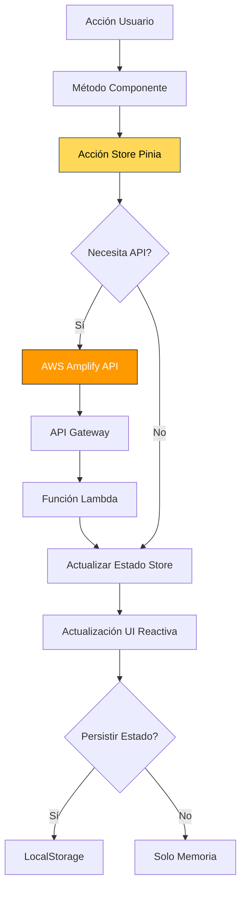

# GIENCO - Plataforma Oficial de Merchandising de la Banda

> Aplicación de Página Única (SPA) de nivel empresarial para comercio electrónico de merchandising de banda, construida con Vue.js 3 y desplegada en infraestructura AWS Cloud.

[](https://vuejs.org/)
[](https://aws.amazon.com/)
[](https://tailwindcss.com/)
[](https://vitejs.dev/)
[](https://pinia.vuejs.org/)
[](https://aws.amazon.com/amplify/)
[](https://github.com)
[](https://d33kjtzxmbw87t.cloudfront.net/)


## Tabla de Contenidos

- [Descripción General](#descripción-general)
- [Arquitectura Cloud (AWS)](#arquitectura-cloud-aws)
- [Stack Tecnológico](#stack-tecnológico)
- [Estructura del Proyecto](#estructura-del-proyecto)
- [Flujo de la Aplicación](#flujo-de-la-aplicación)
- [Características](#características)
- [Acceso y Ejecución](#acceso-y-ejecución)
- [Variables de Entorno](#variables-de-entorno)
- [Pipeline CI/CD](#pipeline-cicd)

---

## Descripción General

**GIENCO** es una plataforma de comercio electrónico moderna diseñada específicamente para la tienda oficial de merchandising de una banda musical. Esta Aplicación de Página Única (SPA) proporciona una experiencia de compra fluida para que los fans naveguen, compren y gestionen merchandising de la banda incluyendo ropa, accesorios y artículos exclusivos.

### Puntos Destacados

- **Arquitectura SPA Moderna**: Construida con Vue.js 3 Composition API para una UI reactiva basada en componentes
- **Nativa de AWS Cloud**: Completamente alojada en infraestructura AWS con distribución CDN global
- **Autenticación Segura**: Integración con AWS Cognito para autenticación de usuarios y control de acceso basado en roles
- **Gestión de Estado**: Pinia para gestión de estado centralizada y persistente
- **Diseño Responsivo**: Diseño mobile-first usando Tailwind CSS 4
- **Rendimiento Optimizado**: Herramienta de build Vite con división de código y tree-shaking
- **Integración CI/CD**: Pipeline de despliegue automatizado con GitHub Actions

---

## Arquitectura Cloud (AWS)

La aplicación aprovecha una arquitectura serverless nativa de la nube en AWS para escalabilidad, seguridad y rendimiento.

### Integración de Servicios AWS

| Servicio | Propósito | Detalles de Implementación |
|---------|---------|------------------------|
| **Amazon S3** | Alojamiento de Sitio Web Estático | Aloja todos los assets estáticos compilados (HTML, CSS, JS, imágenes). Configurado como bucket de sitio web estático con acceso de lectura público para el origen de CloudFront. |
| **Amazon CloudFront** | CDN Global & SSL/TLS | Distribuye contenido globalmente con caché en edge para acceso de baja latencia. Maneja terminación HTTPS y enrutamiento de dominio personalizado. |
| **AWS Cognito** | Autenticación y Autorización de Usuarios | Gestiona user pools para autenticación de clientes y administradores. Maneja registro, inicio de sesión, recuperación de contraseña y generación de tokens JWT para acceso seguro a la API. |
| **AWS Lambda** | APIs Backend Serverless | Ejecuta lógica de negocio para procesamiento de pedidos, gestión de inventario y operaciones de administrador sin gestión de servidores. |
| **Amazon API Gateway** | Gestión de API RESTful | Proporciona endpoints RESTful para comunicación frontend-backend. Se integra con funciones Lambda y Cognito para autenticación. |

### Diagrama de Arquitectura


### Flujo de Tráfico

1. **Petición del Usuario** → El usuario accede a la aplicación mediante la URL de distribución de CloudFront
2. **Entrega CDN** → CloudFront sirve assets estáticos cacheados desde la ubicación edge más cercana
3. **Obtención del Origen** → Si no está cacheado, CloudFront obtiene del bucket S3 origen
4. **Llamadas API** → La app Vue.js hace llamadas API autenticadas a API Gateway
5. **Autenticación** → Cognito valida tokens JWT y gestiona sesiones de usuario
6. **Lógica de Negocio** → Funciones Lambda procesan peticiones e interactúan con la base de datos
7. **Respuesta** → Los datos fluyen de vuelta a través de API Gateway al frontend

---

## Stack Tecnológico

### Framework Frontend

- **Vue.js 3.4.21** - Framework JavaScript progresivo con Composition API
- **Vue Router 4.3.0** - Biblioteca oficial de enrutamiento para navegación SPA
- **Pinia 2.1.7** - Gestión de estado intuitiva y type-safe para Vue
- **Pinia Persisted State 3.2.1** - Plugin para estado persistente entre sesiones

### Estilos y UI

- **Tailwind CSS 4.1.18** - Framework CSS utility-first
- **@tailwindcss/forms** - Plugin de estilos para formularios
- **@tailwindcss/container-queries** - Utilidades de container queries
- **PostCSS & Autoprefixer** - Procesamiento CSS y prefijos de vendor

### Herramientas de Build y Optimización

- **Vite 6.0.0** - Herramienta de build frontend de nueva generación
- **Terser 5.46.0** - Minificación JavaScript con eliminación de console/debugger
- **Sharp 0.34.5** - Optimización de imágenes de alto rendimiento

### Integración Cloud

- **AWS Amplify 6.16.0** - Integración de servicios AWS (Cognito, API Gateway)

### Herramientas de Desarrollo

- **@vitejs/plugin-vue** - Plugin oficial de Vue 3 para Vite
- **Tipo de Módulo ESM** - Soporte nativo de módulos ES

---

## Estructura del Proyecto

```
gienco-band/
│
├── .github/                          # Configuraciones específicas de GitHub
│   └── workflows/
│       └── deploy.yml                # Pipeline CI/CD para despliegues automatizados
│
├── public/                           # Assets estáticos servidos tal cual
│   ├── audio/                        # Música de fondo y efectos de sonido
│   ├── images/                       # Imágenes de productos, fotos de banda, logos
│   └── robots.txt                    # Instrucciones de rastreo para motores de búsqueda
│
├── src/                              # Código fuente de la aplicación
│   ├── components/                   # Componentes Vue reutilizables
│   │   ├── Navbar.vue                # Barra de navegación global con badge de carrito
│   │   ├── Footer.vue                # Footer global con enlaces sociales
│   │   └── NotificationModal.vue     # Modal global de notificaciones/alertas
│   │
│   ├── views/                        # Componentes a nivel de página (rutas)
│   │   ├── Home.vue                  # Página de inicio con productos destacados
│   │   ├── About.vue                 # Información y biografía de la banda
│   │   ├── Products.vue              # Catálogo de productos con filtrado
│   │   ├── Cart.vue                  # Carrito de compras y checkout
│   │   ├── Login.vue                 # Autenticación de clientes
│   │   ├── SignUp.vue                # Registro de clientes
│   │   ├── AdminLogin.vue            # Portal de autenticación de administrador
│   │   └── AdminPanel.vue            # Dashboard de administrador (ruta protegida)
│   │
│   ├── stores/                       # Stores de gestión de estado Pinia
│   │   ├── auth.js                   # Estado de autenticación (integración Cognito)
│   │   ├── cart.js                   # Estado del carrito con persistencia
│   │   └── notification.js           # Gestión de notificaciones globales
│   │
│   ├── composables/                  # Funciones de composición reutilizables
│   │   └── [varios composables]      # Hooks personalizados para lógica compartida
│   │
│   ├── router/                       # Configuración de Vue Router
│   │   └── index.js                  # Definiciones de rutas y guards de navegación
│   │
│   ├── App.vue                       # Componente root con estructura de layout
│   └── main.js                       # Punto de entrada de la aplicación
│
├── index.html                        # Punto de entrada HTML con meta tags
├── vite.config.js                    # Configuración de build de Vite
├── tailwind.config.js                # Configuración de Tailwind CSS
├── package.json                      # Dependencias y scripts del proyecto
├── .env                              # Variables de entorno (ignorado por git)
└── README.md                         # Documentación del proyecto (este archivo)
```

### Descripción de Directorios

- **`/src/components`**: Componentes UI modulares usados en múltiples vistas (Navbar, Footer, Modales)
- **`/src/views`**: Componentes a nivel de página que representan rutas/pantallas completas
- **`/src/stores`**: Stores Pinia para gestión de estado centralizada con persistencia
- **`/src/composables`**: Funciones de composición Vue 3 reutilizables para lógica compartida
- **`/src/router`**: Configuración de enrutamiento con guards de autenticación
- **`/public`**: Assets estáticos que se copian directamente a la carpeta de salida

---

## Flujo de la Aplicación

### Recorrido del Usuario


### Flujos Clave de Usuario

#### 1. **Flujo de Compra del Cliente**
1. **Descubrir** → Usuario aterriza en página Home, ve productos destacados
2. **Explorar** → Navega a página de Productos, filtra/busca merchandising
3. **Seleccionar** → Hace clic en producto para ver detalles y opciones disponibles
4. **Carrito** → Añade artículos al carrito de compras (persistido entre sesiones)
5. **Autenticar** → Inicia sesión o crea cuenta si no está autenticado
6. **Checkout** → Revisa carrito y completa la compra
7. **Confirmación** → Recibe confirmación del pedido y detalles de seguimiento

#### 2. **Flujo de Gestión del Administrador**
1. **Acceder** → Navega al portal de Login de Admin
2. **Autenticar** → Inicia sesión con credenciales de admin (Cognito User Pool)
3. **Verificar** → Guard del router verifica rol de admin en token JWT
4. **Dashboard** → Accede al panel de admin con herramientas de gestión
5. **Gestionar** → Crear/actualizar/eliminar productos, ver pedidos, gestionar inventario

#### 3. **Flujo de Gestión de Estado**


---

## Características

### Características del Cliente

- **Catálogo de Productos**: Explora merchandising oficial de la banda con imágenes y descripciones
- **Búsqueda y Filtrado**: Encuentra productos rápidamente con opciones de filtrado avanzadas
- **Carrito de Compras**: Carrito persistente con cálculos de precio en tiempo real
- **Autenticación de Usuario**: Login y registro seguro con AWS Cognito
- **Diseño Responsivo**: Optimizado para dispositivos móviles, tablets y escritorio
- **Notificaciones**: Feedback en tiempo real para acciones de usuario y errores
- **Experiencia de Marca**: Audio y branding visual inmersivo de la banda

### Características del Administrador

- **Acceso Basado en Roles**: Rutas de admin protegidas con verificación JWT
- **Gestión de Productos**: Operaciones CRUD (crear, leer, actualizar, eliminar) completas
- **Dashboard de Pedidos**: Ver y gestionar pedidos de clientes
- **Gestión de Usuarios**: Monitorear usuarios registrados y permisos

### Características Técnicas

- **Carga Rápida**: Vite HMR para feedback instantáneo en desarrollo
- **División de Código**: Tamaños de bundle optimizados con chunking de vendor
- **Persistencia de Estado**: Estado de carrito y auth sobrevive recargas de página
- **Pipeline CI/CD**: Testing y despliegue automatizado en git push
- **Seguridad**: HTTPS/SSL vía CloudFront, autenticación API segura
- **CDN Global**: Entrega de contenido de baja latencia en todo el mundo

---

## Acceso y Ejecución

Puedes acceder al proyecto de dos formas:

1. **Versión Online (Recomendada)**
   Accede directamente mediante la URL: [https://d33kjtzxmbw87t.cloudfront.net/](https://d33kjtzxmbw87t.cloudfront.net/)

2. **Ejecución Local**
   Si prefieres ejecutar el proyecto en tu máquina:
   
   ```bash
   npm install
   npm run dev
   ```

---

**Construido con dedicación para la Banda GIENCO**
